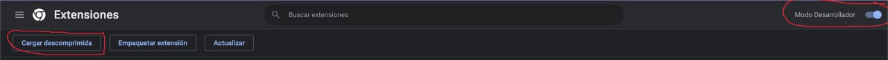
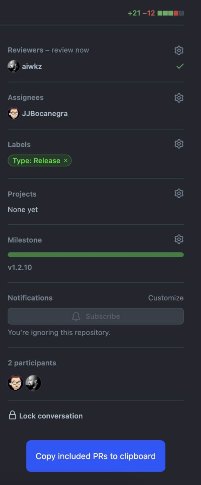

# How to install
1. Click on the three dots on the top right part of  > More tools > Extensions
2. Activate developer mode on the rop right
3. Click on "Load unpacked" button
4. Choose this repository folder

# How to use
Enter any Github pull request page and it will display a new button at the bottom of the right sidebar

