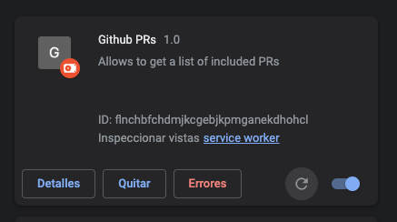

# Install
1. Click on the three dots on the top right part of  > More tools > Extensions
2. Activate developer mode on the rop right
3. Click on "Load unpacked" button
4. Choose this repository folder

# Use
Enter any Github pull request page and it will display a new button at the bottom of the right sidebar. Just click it and it will copy everything to your clipboard. You should then paste this into the PR's description.

# Update
1. Update the extension folder with the last updates from the repository
2. Go to the extensions view in Chrome and press the icon to refresh the extension as in the image below

